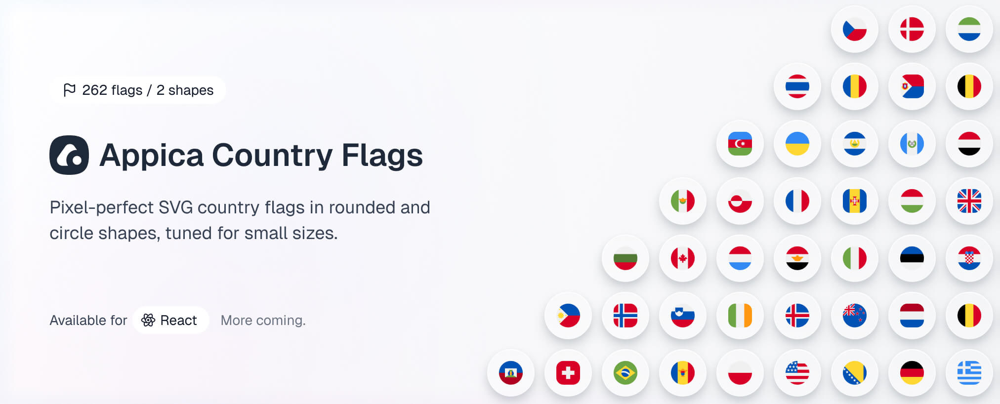

A high-fidelity collection of 262 SVG country flags for the modern web.

This monorepo contains framework-specific packages living under `packages/`. Each package is published to npm independently.

## Packages

|                                                               | Package                       | Version                                                                                                                           | Links                                                                                                             |
| ------------------------------------------------------------- | ----------------------------- | --------------------------------------------------------------------------------------------------------------------------------- | ----------------------------------------------------------------------------------------------------------------- |
|  | `@appica/country-flags-react` |  | [Docs](https://appica.dev/ui/country-flags) · [Changelog](packages/react/CHANGELOG.md) · [Source](packages/react) |

More variants are planned — webfont, Vue and more.

## Figma design file

All 262 flags in both shapes are included in the free [Appica UI Figma file](https://www.figma.com/community/file/1657080448204231925), alongside the component library — use the same flags in your designs that you render in code.

## Stay updated

Follow [@Appica_dev](https://x.com/Appica_dev) on X for release announcements, new flags, and previews of what's coming.

## Contributing

See [CONTRIBUTING.md](CONTRIBUTING.md) for development setup and workflow.

## Design Attribution

Flag designs are based on the [Country Flags](https://www.figma.com/community/file/986015950111698581) Figma Community file. A handful of flags have been redesigned to more accurately represent the original flag while remaining legible at small sizes. A new rounded shape variant has also been introduced.

## License

MIT © [Appica](https://appica.dev)

Free to use in personal and commercial projects.
